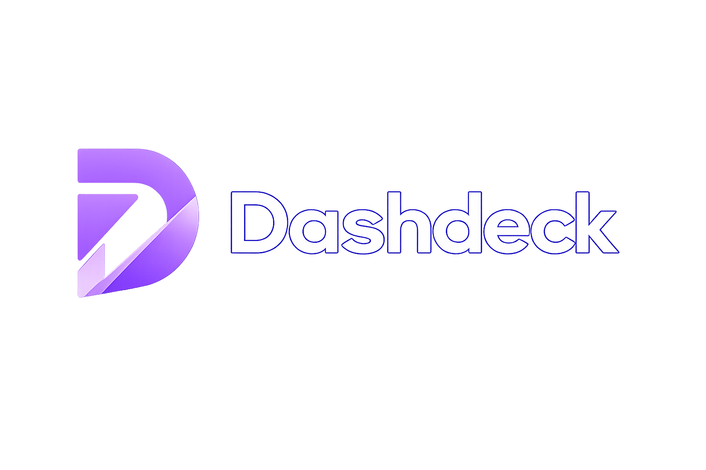
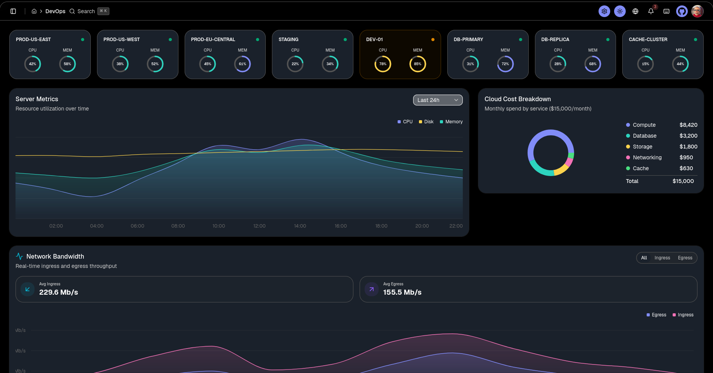
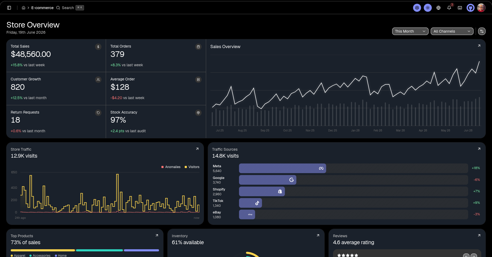
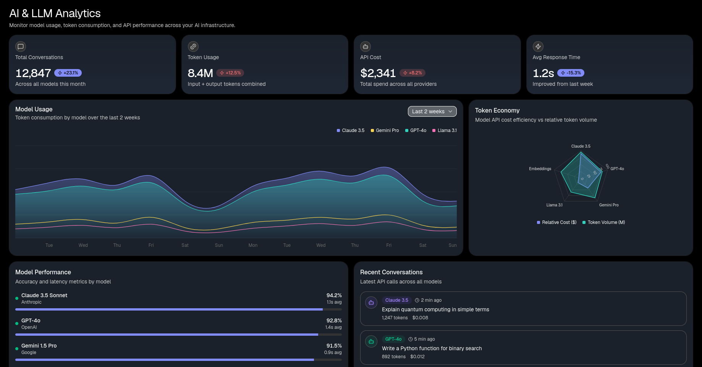

<p align="center">
  <a href="https://github.com/Santosh-Prasad-Verma/Dashdeck">
    
  </a>
</p>

<p align="center">
  <strong>A premium, modern, open-source admin dashboard</strong> built with Next.js 16 (Turbopack), React 19, Tailwind CSS v4, and shadcn/ui.
</p>

<p align="center">
  <a href="https://github.com/Santosh-Prasad-Verma/Dashdeck/blob/main/LICENSE">
    
  </a>
  <a href="https://github.com/Santosh-Prasad-Verma/Dashdeck/stars">
    
  </a>
</p>

---

Dashdeck is a high-fidelity admin dashboard template packed with **37+ interactive dashboard pages**, custom theme presets, fully interactive charts, and client-side state management. It runs entirely on the client side with mock data, requiring **zero backend setup** to launch.

## 📸 Preview

<p align="center">
  
</p>

<p align="center">
  
</p>

<p align="center">
  
</p>

## ✨ Core Features

- **37+ Dashboard Views** — Tailored dashboards for CRM, Finance, DevOps, AI, E-commerce, Academy, Healthcare, Logistics, Real Estate, Sales Analytics, SecOps, Developer Portal, FinOps, MarTech, and more.
- **Theme Preset System** — Support for Light & Dark modes along with multiple gorgeous design presets: Default, Tangerine, Brutalist, and Soft Pop.
- **Interactive SVG Charts** — Custom animated, responsive SVG chart widgets with rich tooltip hover feedback.
- **Kanban Board** — Drag-and-drop task workflow management with client-side persistence.
- **Email & Chat Clients** — Full-fledged email workspace with resizable panels, and messaging interface with conversation stores.
- **Users & Roles** — User CRUD table with inline search, filter, paging, plus access review workflows and permission matrices.
- **Invoice Creator** — Interactive invoicing layout with live calculations and PDF export template.
- **ERD Viewer** — Entity-relationship diagram visualization for database schemas.
- **Reports Builder** — Comprehensive reporting dashboard with multiple chart types and data views.
- **Shortcuts & Commands** — Global action shortcuts (press `?` to show the shortcuts menu).
- **Internationalization** — Full i18n support with English, Spanish, and Hindi out of the box.

## 🛠️ Tech Stack

| Technology | Purpose | Version |
|---|---|---|
| **Next.js** | React Framework with Turbopack | `^16.2.9` |
| **React** | Core UI Library | `^19.2.7` |
| **TypeScript** | Type-safe development | `^5.9.3` |
| **Tailwind CSS** | Styling (v4 compilation) | `^4.1.5` |
| **Shadcn UI** | Component primitive configurations | `^4.11.0` |
| **Zustand** | Lightweight client state stores | `^5.0.14` |
| **Recharts** | Analytics & metrics charts | `^3.8.0` |
| **Biome** | Quick code formatting and linting | `^2.5.0` |
| **Vitest** | Unit & component testing | `^3.x` |

## 📁 Project Structure

```
src/
├── app/
│   ├── (external)/          # Landing Page with premium dark theme & custom SVG charts
│   └── (main)/
│       ├── auth/            # Auth screens (Login, Signup v1/v2)
│       └── dashboard/       # All 37+ dashboard modules
│           ├── ai/          # AI & LLM usage analytics
│           ├── ai-agents/   # AI agent orchestration & monitoring
│           ├── crm/         # CRM sales funnel tracker
│           ├── finance/     # Bank cards, account balances, and spend charts
│           ├── finops/      # Cloud cost optimization dashboard
│           ├── analytics/   # Web traffic, user pageview charts
│           ├── ecommerce/   # Orders, products catalog, and reviews
│           ├── sales/       # Revenue analytics, geography, category breakdowns
│           ├── devops/      # Server load, memory, and database status
│           ├── secops/      # Security operations & compliance monitoring
│           ├── developer/   # API management, webhook logs, developer portal
│           ├── martech/     # Campaign funnels & marketing tech analytics
│           ├── healthcare/  # Patient lists, schedules, and analytics
│           ├── realestate/  # Property grids and agent views
│           ├── academy/     # Classes, grades, and student listings
│           ├── logistics/   # Delivery routes and truck map pins
│           ├── social/      # Social media analytics
│           ├── saas/        # SaaS metrics & subscription analytics
│           ├── inventory/   # Stock management and tracking
│           ├── projects/    # Project management boards
│           ├── productivity/# Task and productivity tracking
│           ├── reports/     # Comprehensive reporting dashboard
│           ├── erd/         # Entity-relationship diagram viewer
│           ├── mail/        # Panel-based Email workspace
│           ├── chat/        # Direct messenger & channels
│           ├── kanban/      # Drag & Drop task boards
│           ├── calendar/    # Event scheduling grid
│           ├── invoice/     # Invoice template engine
│           ├── users/       # User management CRUD
│           ├── roles/       # Role & permission management
│           ├── settings/    # App settings & preferences
│           ├── status/      # System status monitoring
│           ├── changelog/   # Version changelog
│           └── help/        # Help center
├── __tests__/               # Vitest unit & integration tests
├── components/              # Reusable Shadcn UI primitive wraps
├── stores/                  # Zustand global preferences and UI state stores
└── styles/                  # Tailwind configurations and preset CSS files
```

## ⚡ Getting Started

### Prerequisites
Make sure you have [Node.js](https://nodejs.org/) installed (v22+ recommended).

### Installation

```bash
# 1. Clone the repository
git clone https://github.com/Santosh-Prasad-Verma/Dashdeck.git

# 2. Navigate to the project directory
cd Dashdeck

# 3. Install NPM dependencies
npm install

# 4. Start the development server
npm run dev
```

Open [http://localhost:3000](http://localhost:3000) in your browser to view the application.

### Running Tests

```bash
# Run all tests
npm test

# Run tests in watch mode
npm run test:watch
```

## 🤝 Contributing

Contributions are welcome! Please check out [CONTRIBUTING.md](CONTRIBUTING.md) to get started.

## 📄 License

This project is licensed under the MIT License — see the [LICENSE](LICENSE) file for details.

<p align="center">
  
</p>
